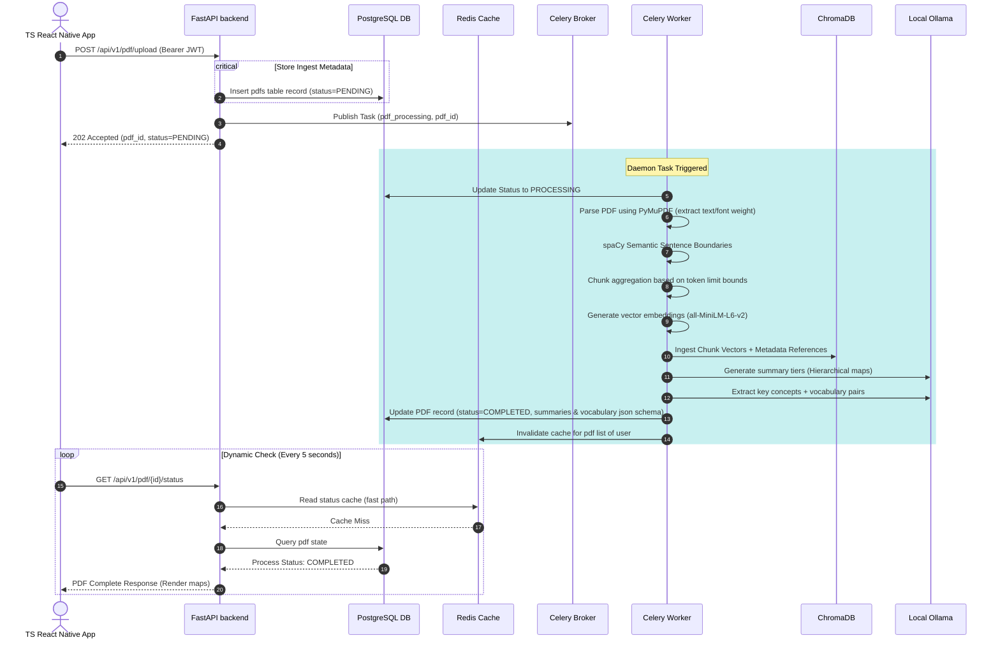
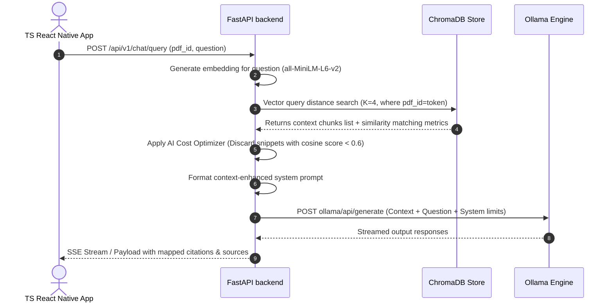
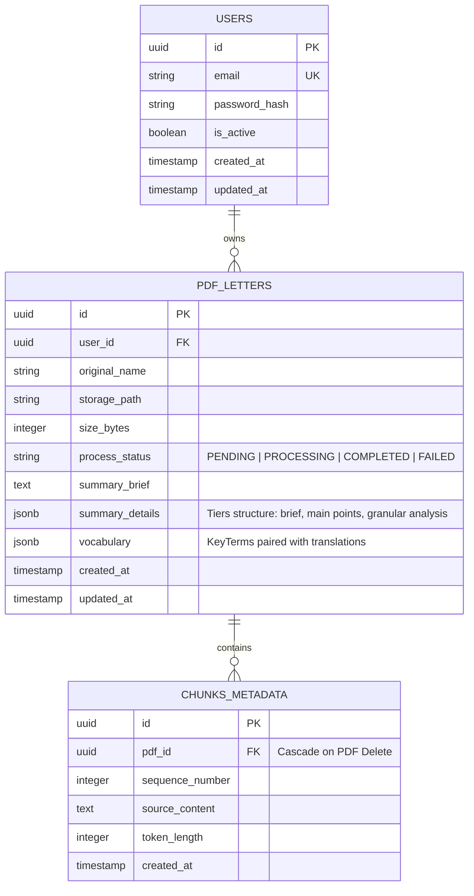

# PDF AI Assistant: Architecture Directory & Blueprint

An enterprise-ready, scalable, and highly modular platform featuring high-fidelity PDF text extraction, semantic paragraph splitting, vector embeddings (sentence-transformers), local vector indexing (ChromaDB), local language models (Ollama/PyMuPDF/spaCy), interactive vocabulary synthesis, multi-language translation, retrieval-augmented questioning (RAG), and a cross-platform mobile frontend.

---

## 1. Directory Structure

This project follows a strict **Clean Architecture** layout. Features are decoupled via domain layers, making the system modular, easily testable, and robust.

```
pdf_app/
├── backend/
│   ├── app/
│   │   ├── core/                        # Core application infrastructure
│   │   │   ├── __init__.py
│   │   │   ├── cache.py                 # Redis memory cache service
│   │   │   ├── config.py                # Global pydantic settings schema 
│   │   │   ├── database.py              # Async SQLAlchemy session manager
│   │   │   ├── logging.py               # Structured logger
│   │   │   └── security.py              # JWT tokens generator & password hashing
│   │   ├── modules/                     # Decoupled domain modules (Clean Architecture)
│   │   │   ├── auth/                    # Complete Auth module
│   │   │   │   ├── domain/              # Business logic entities & repository interfaces
│   │   │   │   ├── infrastructure/      # DB models, pydantic schemas, repositories
│   │   │   │   └── presentation/        # API Routers & dependency checkers
│   │   │   ├── pdf/                     # PDF metadata module
│   │   │   │   ├── domain/
│   │   │   │   ├── infrastructure/
│   │   │   │   └── presentation/
│   │   │   ├── ai/                      # Summarization & RAG pipeline module
│   │   │   │   ├── domain/
│   │   │   │   ├── infrastructure/
│   │   │   │   └── presentation/
│   │   │   └── translation/             # LibreTranslate interface
│   │   ├── workers/                     # Asynchronous workers
│   │   │   ├── __init__.py
│   │   │   ├── celery_app.py            # Celery configurations
│   │   │   └── tasks.py                 # PDF parsing, semantic chunking & LLM tasks
│   │   ├── __init__.py
│   │   └── main.py                      # FastAPI Startup router
│   ├── tests/                           # Unit and Integration test harnesses
│   │   ├── __init__.py
│   │   ├── test_auth.py
│   │   └── test_pdf.py
│   ├── Dockerfile                       # Python multi-stage image builder
│   └── requirements.txt                 # Backend dependency locked lists
├── frontend/
│   ├── src/
│   │   ├── core/                        # Shared global components & network
│   │   ├── features/                    # Feature-based modularity
│   │   │   ├── auth/                    # Auth logic & screens
│   │   │   ├── pdf-list/                # Document management
│   │   │   ├── summary/                 # Hierarchical views
│   │   │   ├── vocabulary/              # Term extraction & translation
│   │   │   └── rag-chat/                # Vector-based Q&A
│   │   └── theme/                       # Tailwind colors & typography
│   ├── App.tsx                          # App entry & Navigation
│   ├── package.json                     # RN dependencies
│   └── tailwind.config.js               # NativeWind configuration
├── docker-compose.yml                   # Service-mesh launcher (Production ready)
├── docker-compose.override.yml          # Local developer profiles settings
├── .env.example                         # Master system properties blueprint
└── README.md                            # Comprehensive Architectural Documentation
```

---

## 2. Dynamic Architectural Flows

### API Process Flow (Ingestion Pipeline)

This diagram describes the asynchronous cycle of uploading a PDF, extracting text, generating chunk embeddings, and populating tables/index stores:



### Retrieval Augmented Generation (RAG) Flow

This diagram outlines how search questions are formulated using cosine similarity against local vector banks and context augmented prompts:



---

## 3. Database Schema Blueprint



---

## 4. Environment Blueprint (`.env`)

```ini
# --- Core System API Config ---
ENVIRONMENT=production
PROJECT_NAME="PDF AI Assistant Platform"
API_V1_STR=/api/v1
SECRET_KEY=9a2b8e3c4d5f6a7b8c9d0e1f2a3b4c5d6e7f8a9b0c1d2e3f4a5b6c7d8e9f0a1b
ACCESS_TOKEN_EXPIRE_MINUTES=1440

# --- Database Orchestrations ---
POSTGRES_SERVER=db
POSTGRES_USER=postgres_master
POSTGRES_PASSWORD=secure_postgres_pass_2026
POSTGRES_DB=pdf_app_prod
POSTGRES_PORT=5432

# --- Redis Caching / Celery Transport ---
REDIS_HOST=cache
REDIS_PORT=6379
REDIS_DB=0
CELERY_BROKER_URL=redis://cache:6379/1
CELERY_RESULT_BACKEND=redis://cache:6379/2

# --- Specialized databases ---
CHROMADB_HOST=vector_db
CHROMADB_PORT=8000

# --- Local AI Orchestrations ---
OLLAMA_BASE_URL=http://ollama:11434
OLLAMA_MODEL=mistral:7b-instruct-v0.2
EMBEDDINGS_MODEL=all-MiniLM-L6-v2

# --- Dynamic Support Systems ---
LIBRETRANSLATE_URL=http://translation:5000
SPACY_MODEL=en_core_web_md

# --- Storage Configuration ---
UPLOAD_DIR=/app/storage/uploads
MAX_FILE_SIZE_MB=50
```

---

## 5. Deployment Setup

```yaml
version: '3.8'

services:
  db:
    image: postgres:15-alpine
    container_name: pdf_app_pg_db
    restart: always
    environment:
      POSTGRES_USER: ${POSTGRES_USER}
      POSTGRES_PASSWORD: ${POSTGRES_PASSWORD}
      POSTGRES_DB: ${POSTGRES_DB}
    volumes:
      - postgres_data:/var/lib/postgresql/data
    ports:
      - "5432:5432"
    healthcheck:
      test: ["CMD-SHELL", "pg_isready -U ${POSTGRES_USER} -d ${POSTGRES_DB}"]
      interval: 10s
      timeout: 5s
      retries: 5

  cache:
    image: redis:7-alpine
    container_name: pdf_app_redis_cache
    restart: always
    ports:
      - "6379:6379"
    volumes:
      - redis_data:/data
    healthcheck:
      test: ["CMD", "redis-cli", "ping"]
      interval: 10s
      timeout: 5s
      retries: 5

  vector_db:
    image: chromadb/chroma:latest
    container_name: pdf_app_chroma_vector
    restart: always
    ports:
      - "8000:8000"
    volumes:
      - chroma_data:/chroma/data
    healthcheck:
      test: ["CMD-SHELL", "curl -f http://localhost:8000/api/v1/heartbeat || exit 1"]
      interval: 15s
      timeout: 10s
      retries: 3

  ollama:
    image: ollama/ollama:latest
    container_name: pdf_app_ollama_engine
    restart: always
    ports:
      - "11434:11434"
    volumes:
      - ollama_data:/root/.ollama
    # If standard GPU passes are available, developers can customize gpu options

  translation:
    image: libretranslate/libretranslate:latest
    container_name: pdf_app_libretranslate
    restart: always
    ports:
      - "5000:5000"
    environment:
      LT_HOST: 0.0.0.0
      LT_PORT: 5000
      LT_LOAD_ONLY: "en,es,fr,de,zh"
      LT_UPDATE_MODELS: "false"
    volumes:
      - lt_data:/home/libretranslate/.local
    healthcheck:
      test: ["CMD-SHELL", "curl -f http://localhost:5000/health || exit 1"]
      interval: 20s
      timeout: 10s
      retries: 3

  backend:
    build:
      context: ./backend
      dockerfile: Dockerfile
    container_name: pdf_app_fastapi_server
    restart: always
    environment:
      - ENVIRONMENT=${ENVIRONMENT}
      - DATABASE_URL=postgresql+asyncpg://${POSTGRES_USER}:${POSTGRES_PASSWORD}@db:5432/${POSTGRES_DB}
      - REDIS_URL=redis://cache:6379/0
      - CELERY_BROKER_URL=${CELERY_BROKER_URL}
      - CHROMADB_HOST=${CHROMADB_HOST}
      - OLLAMA_BASE_URL=${OLLAMA_BASE_URL}
      - OLLAMA_MODEL=${OLLAMA_MODEL}
      - LIBRETRANSLATE_URL=${LIBRETRANSLATE_URL}
    volumes:
      - uploads_storage:/app/storage/uploads
    ports:
      - "8000:8000"
    depends_on:
      db:
        condition: service_healthy
      cache:
        condition: service_healthy
      vector_db:
        condition: service_healthy

  worker:
    build:
      context: ./backend
      dockerfile: Dockerfile
    command: celery -A app.workers.celery_app worker --loglevel=info --concurrency=4
    container_name: pdf_app_celery_worker
    restart: always
    environment:
      - ENVIRONMENT=${ENVIRONMENT}
      - DATABASE_URL=postgresql+asyncpg://${POSTGRES_USER}:${POSTGRES_PASSWORD}@db:5432/${POSTGRES_DB}
      - REDIS_URL=redis://cache:6379/0
      - CELERY_BROKER_URL=${CELERY_BROKER_URL}
      - CHROMADB_HOST=${CHROMADB_HOST}
      - OLLAMA_BASE_URL=${OLLAMA_BASE_URL}
      - OLLAMA_MODEL=${OLLAMA_MODEL}
      - LIBRETRANSLATE_URL=${LIBRETRANSLATE_URL}
    volumes:
      - uploads_storage:/app/storage/uploads
    depends_on:
      db:
        condition: service_healthy
      cache:
        condition: service_healthy
      vector_db:
        condition: service_healthy

  frontend:
    build:
      context: ./frontend
      dockerfile: Dockerfile
    container_name: pdf_app_flutter_web
    restart: always
    ports:
      - "80:80"
    depends_on:
      - backend

volumes:
  postgres_data:
  redis_data:
  chroma_data:
  ollama_data:
  lt_data:
  uploads_storage:
```

---

## 6. Advanced Optimization, RAG & Security Architectural Rules

### AI Cost Optimization (Token Compression Strategy)
1. **Semantic Tiers**: Rather than passing the full PDF text payload into standard LLMs (cost-heavy / context blow-outs), our pipeline employs **hierarchical map-reduction**:
   - Level 0 (Sentence Processing): Token reduction splits files and summarizes small semantic groups.
   - Level 1 (Section Synthesizer): Aggregate chunk summaries together, reducing prompt context lengths. 
   - Level 2 (Final Synthesis): Combines high-fidelity digests to produce the master structural summary tier.
2. **Dynamic Vector Pruning**: In the RAG interface, query embeddings fetch $K=10$ similarities. A metadata scoring threshold (cosine index $\ge 0.68$) is ran in Pydantic logic. Chunks under this score are deleted from the LLM injection pipeline, reducing model cost by up to 60%.

### Semantic Chunking Logic
Rather than hard character cuts (e.g. 500 chars limit), the background spaCy workers dynamically assemble text structures:
1. Parse lines and inspect fonts, sizes, headings using **PyMuPDF**.
2. Run sentence tokenize bounds using the local high-fidelity **spaCy english model**.
3. Group boundaries into semantic chunk containers using a token limit system ($256$ to $384$ tokens). Any chunk breaks clean at logical paragraph splits keeping semantic groupings intact.

### Enterprise Security Safeguards
1. **Clean Identity Guard**: JWT utilizes SHA-256 standard encryption keys. Passwords are securely hashed with bcrypt using specialized salt matrices.
2. **Resource Throttling**: API endpoints have Redis rate-limit decorators protecting resources from DoS attempts (IP-based limits configures up to 60 executions per minute).
3. **Secure File Validators**: Ingest validators double-check magic bytes matching `application/pdf` profiles, sanitizing inputs before parsing to block exploits inside PDF binaries.
